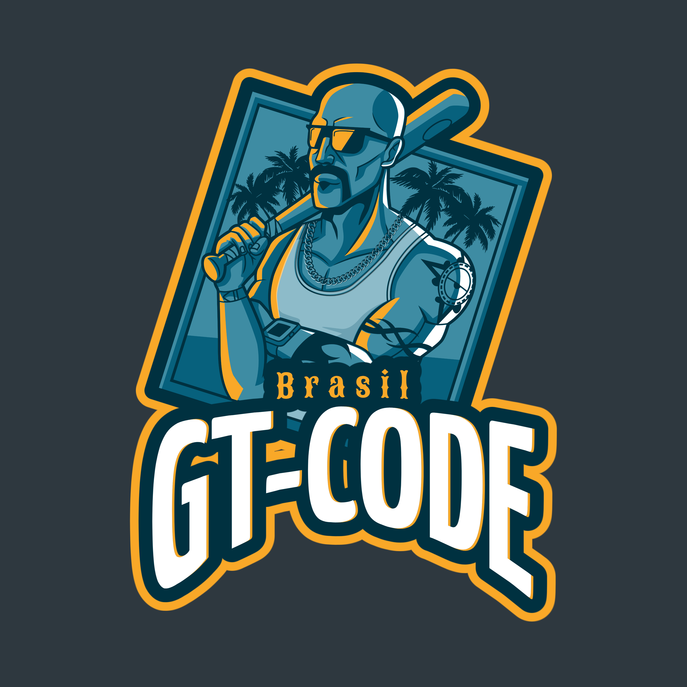

# GT-CODE

    

GT-CODE is a project that aims to solve augmented reality exercises inspired by the GTA game.

# Introduction 

The exercises were based on HiuKim Yuen's [web augmented reality course](https://www.udemy.com/course/introduction-to-web-ar-development/),
I recommend the purchase even for a better use. Thus, the exercises here called "missions"
were within one of several areas of augmented reality called "image detection".

To understand more about image tracking I will leave some support links:

1 [MindAR](https://hiukim.github.io/mind-ar-js-doc/)

2 [Image for Tracking in AR](https://blog.pictarize.com/how-to-choose-a-good-target-image-for-tracking-in-ar-part-1/)

3 [Pictarize](https://pictarize.com/image-analyzer/)

4 [Three.js](https://threejs.org/)

## What is the difference between GTA and GT-CODE ??

- GTA: It is an action-adventure video game.

- GT-CODE: A series of **missions** in augmented reality with image detection.

## Missions

If you've played GTA, you know that in order to evolve in the game, you must complete missions. In this way, each exercise in augmented reality we will call missions, where I will explain how the structure for projecting images in augmented reality is.

It's very important that you don't skip missions because to understand mission 3 you need to have gone through mission 1.

Get ready to meet the future of apps and the web!!

[Start here](https://github.com/PedroPapoti/GT-CODE/tree/main/missions/mission1) !!

If you have any doubts, please contact me by email pedropapoti@gmail.com.

