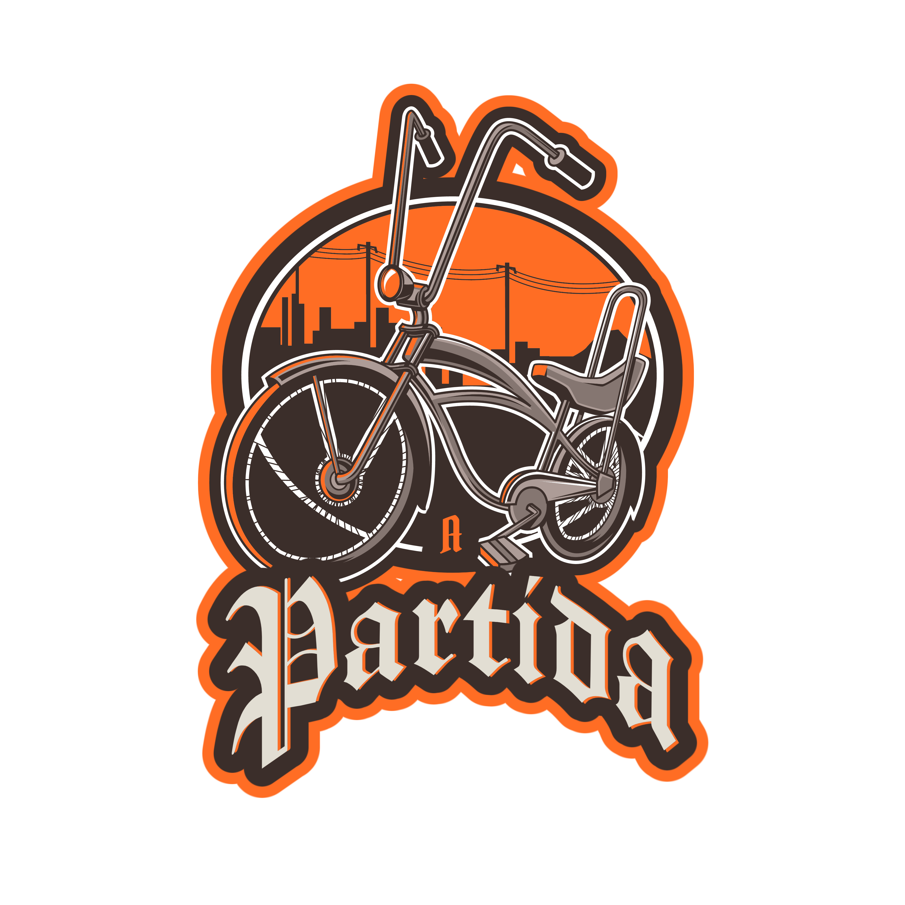

# Mission 1

<p aling="center">
    
</p>

GT-CODE is a project that aims to solve augmented reality exercises inspired by the GTA game.

# Introduction 

Here I will explain the base structure of the code for the resolution of the missions.

**Mission 1: Develop a program that shows the GTA bike in augmented reality.**

## Mission 1
First access the missions folder and create a new folder called mission 1.

Inside the mission 1 folder create an HTML file and two more files called `main.js` and `style.css` :

```html
    <!DOCTYPE html>
<html lang="pt-br">
<head>
    <meta charset="UTF-8">
    <meta http-equiv="X-UA-Compatible" content="IE=edge">
    <meta name="viewport" content="width=device-width, initial-scale=1.0">
    <script src="./main.js"></script>
    <link rel="stylesheet" href="style.css">
    <title>Mission1</title>
</head>
<body>
  
</body>
</html>
```
## Libs

We will use the [MindAR](https://hiukim.github.io/mind-ar-js-doc/) augmented reality library for image tracking. In this way, we will integrate the MindAR library with [Three.js](https://threejs.org/) to work with 3D images.


You can integrate Three.js in two ways:

1. Insert the script into the HTML file.
```javascript
    <script src="https://cdn.jsdelivr.net/npm/mind-ar@1.1.4/dist/mindar-image-three.prod.js"></script>
```
2.  Npm
```
> npm i mind-ar --save
```
```
import 'mind-ar/dist/mindar-image-three.prod.js';
```

## Back to mission 1!!

Now that you know the libraries change the HTML file to:

```html
    <!DOCTYPE html>
<html lang="pt-br">
<head>
    <meta charset="UTF-8">
    <meta http-equiv="X-UA-Compatible" content="IE=edge">
    <meta name="viewport" content="width=device-width, initial-scale=1.0">
    <script src="../../libs/mindar/mindar-image-three.prod.js"></script> 
    <script src="./main.js" type="module"></script>
    <link rel="stylesheet" href="style.css">
    <title>Mission1</title>
</head>
<body>
  
</body>
</html>
```
- Note that we added a new script mindar-image-three.prod.js which is inside the libs/mindar folder and added to the script main type = "module" this because we are going to import some functions later.

## Main.js

Remember that our mission is to show the GTA bike in augmented reality ?? Right!!

```javascript
    const Three = window.MINDAR.IMAGE.THREE

    document.addEventListener('DOMContentLoaded', () => {
        const start = async() => {
            const mindarThree = new window.MINDAR.IMAGE.MindARThree(()=> {
                container: document.bory,
                imageTargetSrc: 
            });
            
            const {renderer, scene, camera} = mindarThree;
        }
    });
```
- First we create a variable called Three that will receive the properties of the mindar-image-three.prod.js file
then we added the [DOMContentLoaded](https://developer.mozilla.org/pt-BR/docs/Web/API/Window/DOMContentLoaded_event) event that fires when all HTML has been completed and completed.
In this way, we will create another variable called start which will be called at the end of the program.

- Note that start takes an asynchronous function because it will allow us to call the await keyword.

- Then we create another variable called mindarThree that receives inside the MindARThree function
two parameters:
1) container: The object that we want to access inside the HTML in this case the body.
2) imageTargetSrc: The image that will be used to capture detection points.

- Finally, we create an array with 3 parameters that receives mindarThree.


## The final part!!
```javascript
import { loadGLTF } from "../../libs/loader.js";
const THREE = window.MINDAR.IMAGE.THREE;

document.addEventListener('DOMContentLoaded', () => {
    const start = async() => {
        const mindarThree = new window.MINDAR.IMAGE.MindARThree({
            container: document.body,
            imageTargetSrc: '../../targets/mission1/gtcode.mind',
        });

        const {renderer, scene, camera} = mindarThree;

        const light = new THREE.HemisphereLight(0xffffff, 0xbbbbff, 1);
        scene.add(light);

        const bikeAnchor = mindarThree.addAnchor(0);

        const bike = await loadGLTF('../../models/bike/scene.gltf');
        scene.scale.set(0.1, 0.1, 0.1);
        scene.position.set(0, -0.4, 0);
        bikeAnchor.group.add(bike.scene);

        await mindarThree.start();
            renderer.setAnimationLoop(() => {
            renderer.render(scene,camera);
        });
    }
    start();
});
```
- Now we pass to the variable bike the object to be projected through the [loadGLTF](https://threejs.org/manual/#en/load-gltf) function that was imported from loader.js. Then we pass scale position and anchor it through:

```javascript
const bikeAnchor = mindarThree.addAnchor(0);
bikeAnchor.group.add(bike.scene);
```
- Anchor here will represent the position of the object to be incised when the `gtcode.mind` image is detected.

- To [render](https://threejs.org/manual/#en/fundamentals) a scene in 3D we pass `scene` and `camera` to show it on the screen.

```javascript
renderer.setAnimationLoop(() => {
    renderer.render(scene,camera); 
});
```
This is the structure of the project, the missions in sequence will follow this logic with small changes!!

If you want to see the result, access my profile on instagra [@pedropapoticalazans](https://www.instagram.com/pedropapoticalazans/) and go to the "GT-CODE" store, I'll talk more about the project there.

If you have any questions, please contact me by email pedropapoti@gmail.com.
