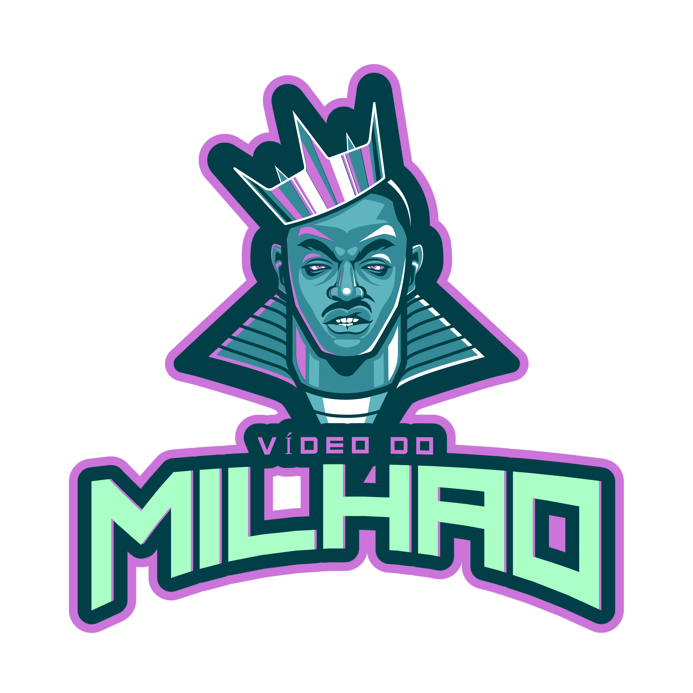
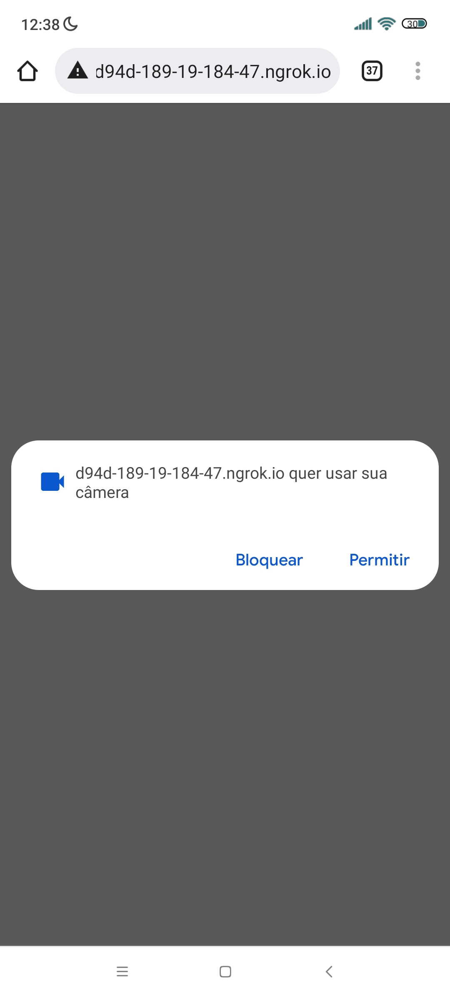
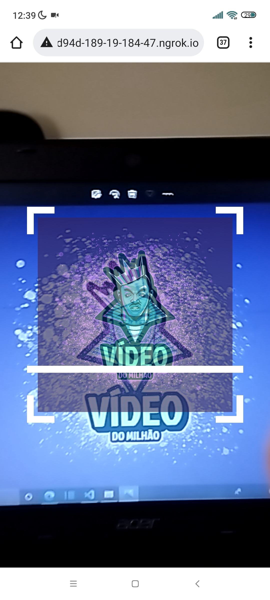

# Mission 3

<p aling="center">
    
</p>

GT-CODE is a project that aims to solve augmented reality exercises inspired by the GTA game.

# Introduction 

Now that you know how everything works, it's time to run!!.

**Mission 3: Run the code below and watch the video I made for you!!.**

## Mission 3
index.html:
```html
    <!DOCTYPE html>
<html lang="pt-br">
<head>
    <meta charset="UTF-8">
    <meta http-equiv="X-UA-Compatible" content="IE=edge">
    <meta name="viewport" content="width=device-width, initial-scale=1.0">
    <script src="../../libs/mindar/mindar-image-three.prod.js"></script>
    <script src="./main.js" type="module"></script>
    <link rel="stylesheet" href="style.css">
    <title>Mission3</title>
</head>
<body>
    <div id="scanning" class="hidden">
        <div class="inner">
      
      <div class="scanline"></div>
        </div>
      </div>
</body>
</html>
```
style.css:
```css
html, body {position: relative; margin: 0; width: 100%; height: 100%; overflow: hidden;}

#container {
	width: 100vw;
	height: 100vh;
	position: relative;
	overflow: hidden;
        }

      #scanning {
	display: flex;
	align-items: center;
	justify-content: center;
	position: absolute;
	left: 0;
	right: 0;
	top: 0;
	bottom: 0;
	background: transparent;
	z-index: 2;
         }
      @media (min-aspect-ratio: 1/1) {
	#scanning .inner {
	  width: 50vh;
	  height: 50vh;
	}
      }
      @media (max-aspect-ratio: 1/1) {
	#scanning .inner {
	  width: 80vw;
	  height: 80vw;
	}
      }

      #scanning .inner {
	display: flex;
	align-items: center;
	justify-content: center;
	position: relative;

	background:
	  linear-gradient(to right, white 10px, transparent 10px) 0 0,
	  linear-gradient(to right, white 10px, transparent 10px) 0 100%,
	  linear-gradient(to left, white 10px, transparent 10px) 100% 0,
	  linear-gradient(to left, white 10px, transparent 10px) 100% 100%,
	  linear-gradient(to bottom, white 10px, transparent 10px) 0 0,
	  linear-gradient(to bottom, white 10px, transparent 10px) 100% 0,
	  linear-gradient(to top, white 10px, transparent 10px) 0 100%,
	  linear-gradient(to top, white 10px, transparent 10px) 100% 100%;
	background-repeat: no-repeat;
	background-size: 40px 40px;
      }

      #scanning.hidden {
	display: none;
      }

      #scanning img {
	opacity: 0.6;
	width: 90%;
	align-self: center;
      }

      #scanning .inner .scanline {
	position: absolute;
	width: 100%;
	height: 10px;
	background: white;
	animation: move 2s linear infinite;
      }

      @keyframes move {
	0%, 100% { top: 0% }
	50% { top: calc(100% - 10px) }
      }
```
main.js:
```javascript
import{loadVideo} from '../../libs/loader.js'
const THREE = window.MINDAR.IMAGE.THREE;

document.addEventListener('DOMContentLoaded', () => {
       const start = async() => { 
        const mindarThree = new window.MINDAR.IMAGE.MindARThree({
            container: document.body,
            imageTargetSrc: '../../targets/mission3/mission3.mind',
            uiScanning: "#scanning",
            uiLoading: "no"
        });

        const {renderer, scene, camera} = mindarThree;

        const video = await loadVideo('../../targets/mission3/gtcode-video.mp4');
        const texture  = new THREE.VideoTexture(video);

        const geometry = new THREE.PlaneGeometry();
        const material = new THREE.MeshBasicMaterial({map: texture});
        const plane = new THREE.Mesh(geometry,material)

        const anchor = mindarThree.addAnchor(0);
        anchor.group.add(plane);

        anchor.onTargetFound = () => {
            video.play();
        }
        anchor.onTargetLost = () => {
            video.pause();
        }
        
        await mindarThree.start();
        renderer.setAnimationLoop(() => {
            renderer.render(scene,camera);
        });
     }
     start();
});
```
* After placing everything in its proper directory when running, you will see a screen similar to the one below:

<p aling="center">
    
</p>

* Click allow for the system to continue running the program.

<p aling="center">
    
</p>

* This will be the screen that will be appearing for you if everything is right!!

* Now place the same image you are seeing in the square:
<p aling="center">
    
</p>

> You will find the image inside the `targets/mission3/mission3-target.png` folder

> Attention : If you place the image and nothing happens, it is a sign that the image points were not found. That way to reset the image at different points enter the site and [compile the image again](https://hiukim.github.io/mind-ar-js-doc/tools/compile), choose the target.mind file that looks better.


If you have any questions, please contact me by email pedropapoti@gmail.com.